# Beyond Decor
A portfolio and inquiry system website for Beyond Decor, a party and entertainment service which offers complete decor packages and party needs.
* See live at [https://beyond-decor.vercel.app/](https://beyond-decor.vercel.app/)
* A course requirement for AL102

## User interface
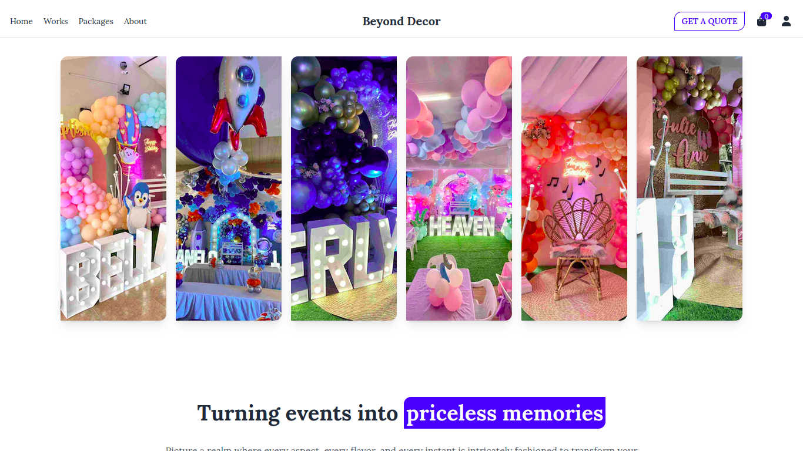
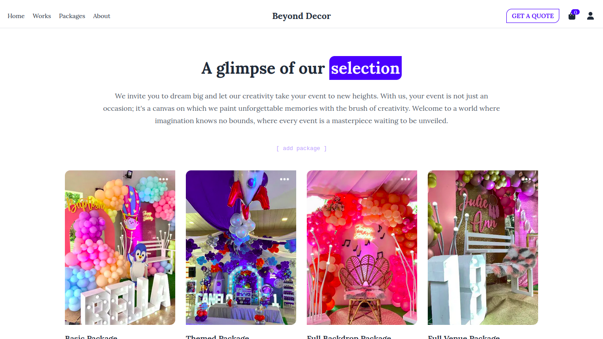
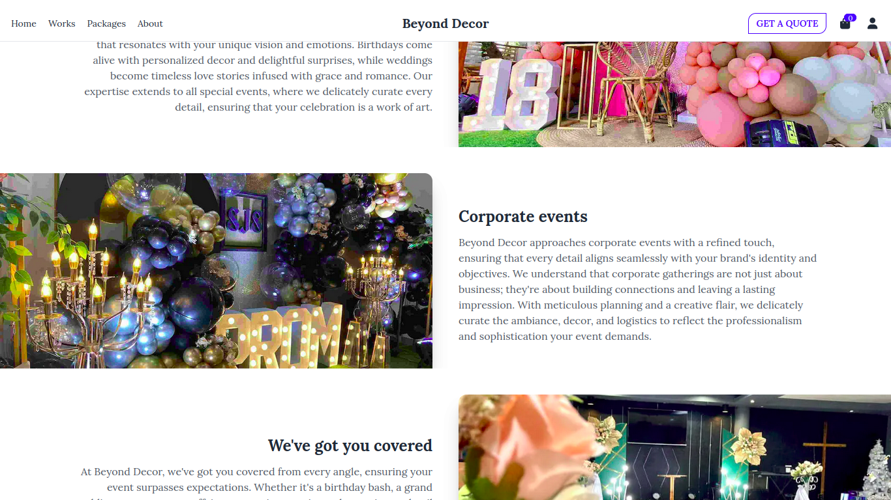
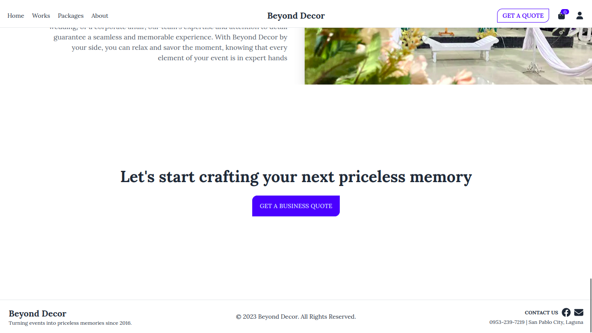
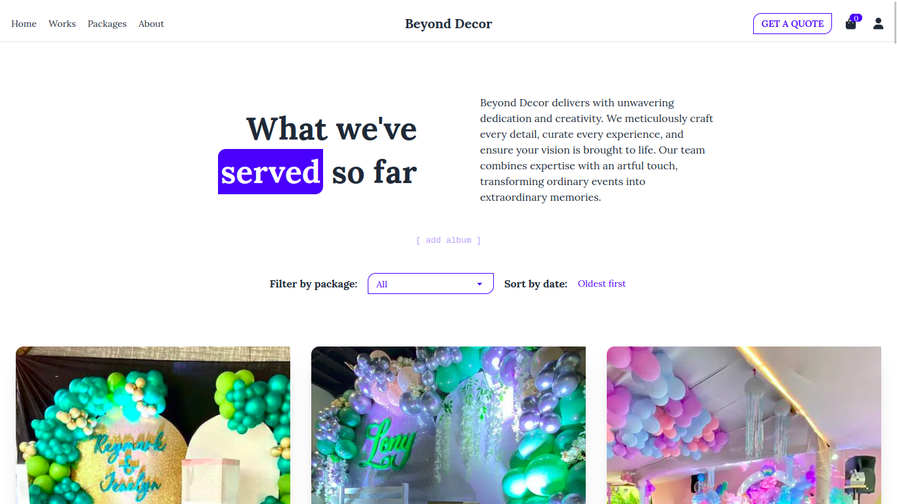
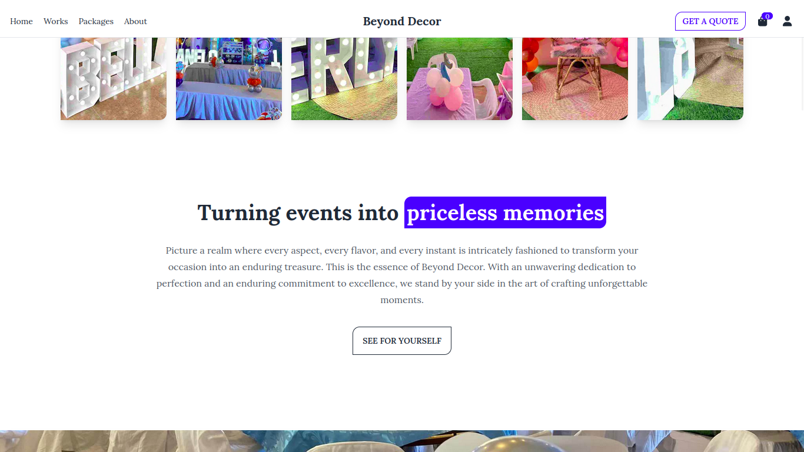
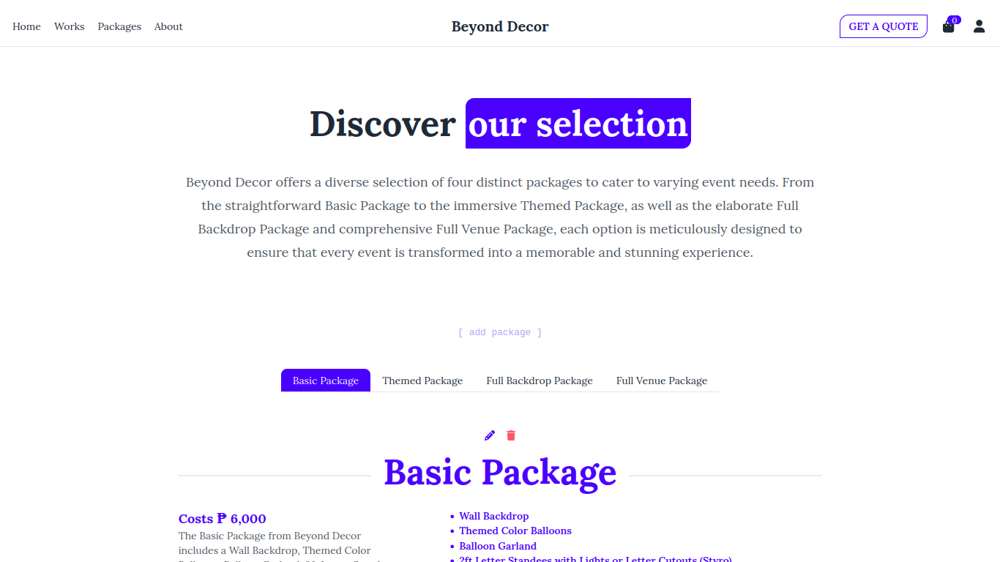
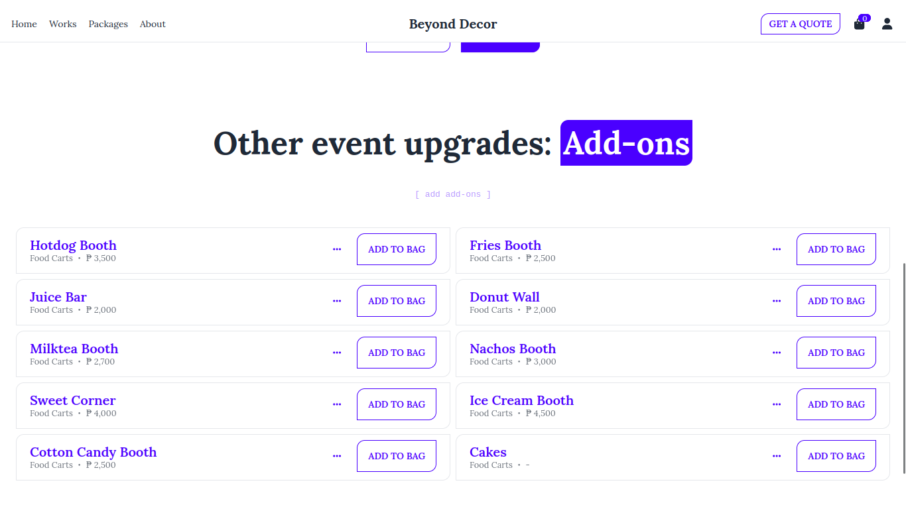
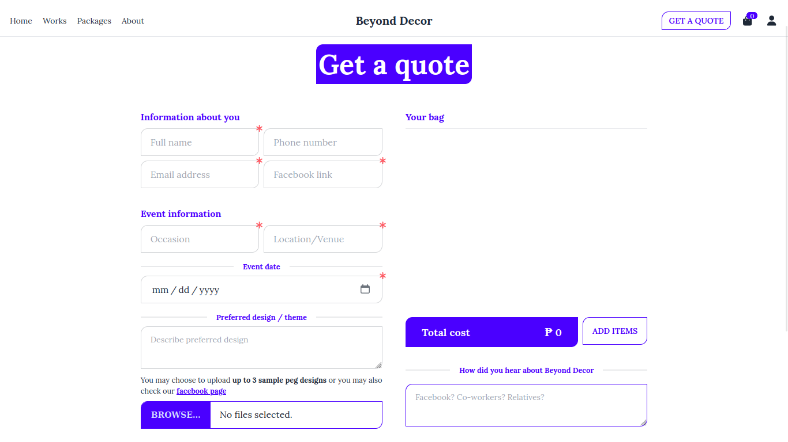
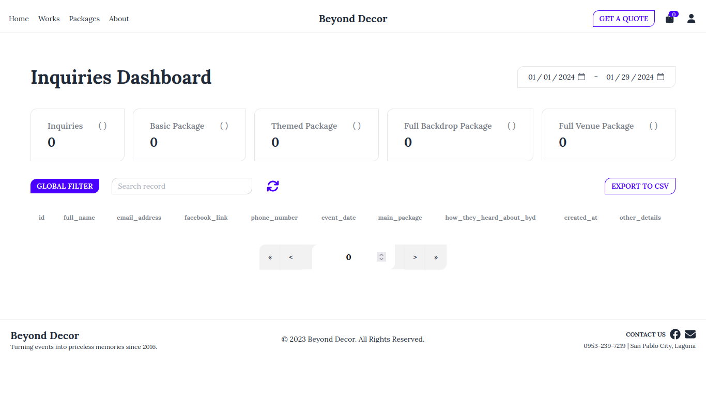
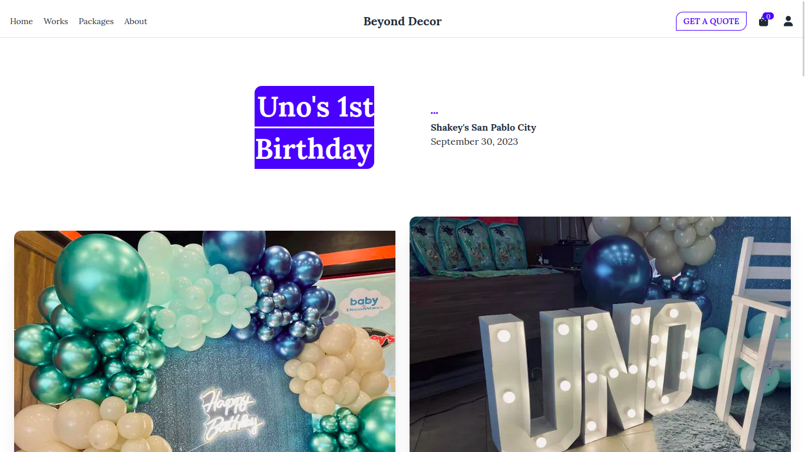

## Technologies used
* React.js: A powerful JavaScript library for building user interfaces, allowing for a seamless and dynamic user experience.
* Next.js: A React framework that enables server-side rendering and helps optimize performance, providing a fast and efficient web application.
* Pocketbase: A reliable and flexible database solution, ensuring the storage and retrieval of data for a smooth user experience.
* DaisyUI: A UI component library that enhances the visual appeal of the website, providing a modern and polished design.
* Tailwind CSS: A utility-first CSS framework that simplifies styling and customization, resulting in a responsive and visually appealing layout.
